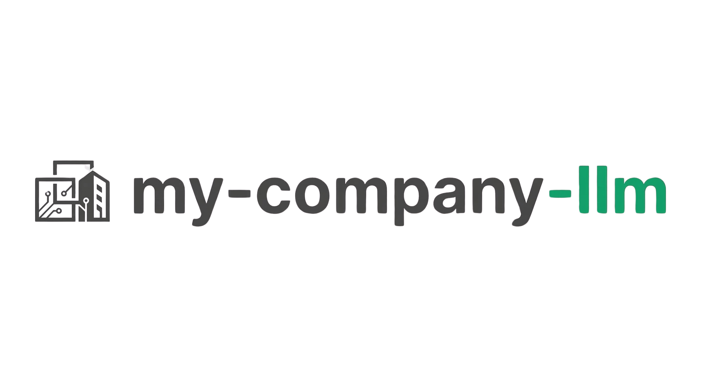

<p align="center">
  
</p>

<p align="center">
  <strong>Build and run your entire company with AI agents.</strong>
</p>

<p align="center">
  
  
  
</p>

---

**my-company-llm** is an open-source platform that lets you create a digital company powered by AI. Define departments, deploy AI agents with real roles, give directives in plain English, and watch your AI workforce execute — from marketing campaigns to engineering tasks.

> This project is in **beta**. Things may break, APIs may change, and we'd love your feedback. Star the repo and open an issue if you run into anything.

---

## What Can It Do?

| You say... | What happens |
|---|---|
| *"Launch the Q1 marketing campaign"* | Message is routed to your Marketing Lead agent, who creates tasks, delegates to team members, and reports back |
| *"Draft a press release for our product launch"* | Your content agent writes it, saves it to the knowledge base, and puts it up for your approval |
| *"Post this update to Twitter and LinkedIn"* | Social media agents post on your behalf using connected accounts |
| *"How many tasks are in progress?"* | The system pulls real-time stats from your task board |

## How It Works

```
You (CEO) ──> Chat ──> Smart Router ──> Right Department ──> Right Agent ──> Done
```

1. **Create departments** — Engineering, Marketing, Design, Sales, or anything you need
2. **Add AI agents** — Each has a name, role, personality, memory, and tools
3. **Give directives** — Type naturally. The router figures out who should handle it
4. **Track everything** — Kanban boards, approvals, and real-time status updates

## Tech Stack

| Layer | Stack |
|-------|-------|
| **Backend** | FastAPI, LangGraph, ChromaDB, LiteLLM |
| **Frontend** | Next.js, Tailwind CSS, shadcn/ui |
| **LLMs** | GPT-4o (leads), Claude Sonnet (creative), GPT-4o-mini (routing) |
| **Storage** | SQLite + ChromaDB (per-agent vector memory) |

## Quick Start

You need **Python 3.12+**, **Node.js 18+**, and an **OpenAI API key**.

```bash
# 1. Clone
git clone https://github.com/taha-can/my-company-llm.git
cd my-company-llm

# 2. Configure
cp .env.example .env
# Open .env and add your OPENAI_API_KEY (required)

# 3. Backend
python -m venv .venv
source .venv/bin/activate
pip install -r backend/requirements.txt
uvicorn backend.main:app --reload --port 8000

# 4. Frontend (new terminal)
cd frontend
npm install
npm run dev
```

Open **http://localhost:3000** — the app will walk you through setting up your company on first launch.

## Features

- **Departments & Agents** — Mirror your real org with AI-staffed departments
- **Natural-Language Routing** — Messages auto-route to the right team and agent
- **Persistent Memory** — Each agent remembers past conversations and uploaded docs via ChromaDB
- **Task Management** — Kanban boards with automated assignment and approval workflows
- **Integrations** — Gmail, Calendar, Drive, Twitter/X, LinkedIn, Instagram, Slack
- **Office Map** — Visual overview of your AI workforce
- **MCP Support** — Connect external tools via Model Context Protocol
- **Knowledge Base** — Upload documents and your agents learn from them

## Project Structure

```
my-company-llm/
├── backend/            # FastAPI + LangGraph + ChromaDB
│   ├── api/            # REST + WebSocket endpoints
│   ├── engine/         # Agent runner, memory, routing
│   ├── tools/          # Integrations (social, email, calendar)
│   └── db/             # SQLite models
├── frontend/           # Next.js + Tailwind + shadcn/ui
│   └── src/
│       ├── app/        # Dashboard, chat, agents, tasks
│       └── components/ # UI components
├── data/               # Created at runtime
└── .env.example        # Environment variables template
```

## Environment Variables

Copy `.env.example` to `.env` and fill in:

| Variable | Required | Description |
|----------|----------|-------------|
| `OPENAI_API_KEY` | Yes | Powers routing, agents, and embeddings |
| `ANTHROPIC_API_KEY` | No | Enables Claude-based creative agents |
| `JWT_SECRET` | Yes | Change from default for security |
| `GOOGLE_CLIENT_ID` | No | Google OAuth sign-in |
| `GOOGLE_CLIENT_SECRET` | No | Google OAuth sign-in |
| `NEXTAUTH_SECRET` | Yes | Change from default for security |

## Contributing

This is a beta project and contributions are very welcome -- bug reports, feature requests, new integrations, UI improvements, docs, and tests.

Read the full [Contributing Guide](CONTRIBUTING.md) for setup instructions and guidelines.

**Quick version:**

1. Fork the repo
2. Create a feature branch (`git checkout -b feature/my-feature`)
3. Make your changes and test locally
4. Open a Pull Request

If you find a bug or have a feature request, please [open an issue](https://github.com/taha-can/my-company-llm/issues).

## License

MIT

---

<p align="center">
  <sub>Built with AI, for AI-powered teams.</sub>
</p>
